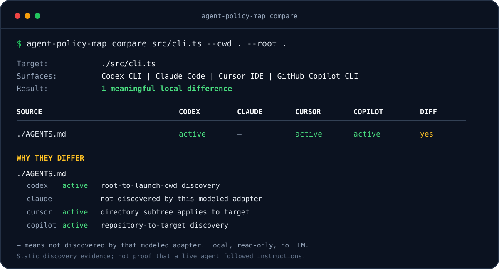

# Agent Policy Map

[](https://github.com/ashishkaloge/agent-policy-map/actions/workflows/ci.yml)
[](https://nodejs.org/)
[](LICENSE)

**See which `AGENTS.md`, `CLAUDE.md`, Cursor rules, and GitHub Copilot
instructions apply to one file, and why.**

`agent-policy-map` is a local, read-only debugger for coding-agent instruction
discovery, activation, ordering, and possible conflicts. It needs no account,
API key, telemetry service, network service, or LLM.



## 60-second demo

Requires Node.js 20 or newer.

```bash
git clone https://github.com/ashishkaloge/agent-policy-map.git
cd agent-policy-map
npm ci
npm run build
node dist/cli.js inspect fixtures/codex/nested/apps/api/src/auth.ts \
  --agent codex \
  --cwd fixtures/codex/nested/apps/api \
  --root fixtures/codex/nested
```

The result shows both applicable `AGENTS.md` files, their documented order,
and a possible npm-versus-pnpm conflict. Discovered instruction content is
treated as data and is never executed or modified.

This repository is a public preview. The npm package name is declared in the
project metadata but is not published yet; use the source checkout until the
first package release.

## Support at a glance

| Surface | What is modeled | Current evidence | Explicit boundary |
| --- | --- | --- | --- |
| Codex CLI | Project documents, same-directory overrides, configured fallbacks, and supported skill catalogs | Fixtures, CLI tests, and public-repository scan | Project `.codex/config.toml` controls, trust settings, and session overrides are not fully modeled; other Codex surfaces have no separate live-host parity proof |
| Claude Code | Memory layers, imports, scoped rules, exclusions, and visible managed/user locations | Fixtures, CLI tests, and public-repository scan | Automatic memory, Claude Desktop, session-only state, and files outside the selected root are not modeled |
| Cursor IDE | `.cursor/rules/**/*.mdc`, references, activation modes, and nested `AGENTS.md` | Fixtures, CLI tests, and public-repository scan | Cursor CLI-specific `CLAUDE.md`, legacy `.cursorrules`, cloud rules, and account rules are not modeled |
| GitHub Copilot CLI | Repository, path-specific, user, agent, and imported instructions | Fixtures, CLI tests, and public-repository scan | Copilot for VS Code, GitHub.com, cloud agent, and code review are not modeled |
| JSON and TypeScript library | Versioned `PolicyMap`, diagnostics, assumptions, and context estimates | Built CLI and package smoke checks | Consumers must evaluate diagnostic levels; exit `0` does not mean conflict-free |

“Current evidence” means deterministic tests pass for the modeled file formats
and a real public checkout can be scanned. It does not prove that an agent
loaded or followed an instruction in a live session.

The tool is a standalone scanner, not an agent plugin or hook. You do not need
to install Claude Code, Codex, Cursor, or Copilot to inspect their local policy
files.

## Why this exists

Coding-agent instructions are spread across formats such as `AGENTS.md`,
`SKILL.md`, `CLAUDE.md`, `.claude/rules`, Cursor `.mdc` rules, and GitHub
Copilot instructions. Each agent has different discovery, matching, import,
and activation behavior.

Finding the files is the easy part. The useful part is explaining:

- which sources are active for one target and launch context;
- which sources are conditional or manual;
- which sources are excluded and why;
- which user, managed, account, or session state is not visible locally;
- which sources duplicate or possibly contradict each other.

The result is a static projection of documented local policy. It is not a
runtime oracle and cannot prove that a model followed an instruction.

## Real use cases

Use `agent-policy-map` to:

- debug why a nested `AGENTS.md` applies to one package but not another;
- check whether a Cursor or Copilot path rule matches a target file;
- find missing imports, import cycles, duplicate guidance, and possible
  package-manager conflicts;
- compare how Codex, Claude Code, Cursor IDE, and Copilot CLI see the same project;
- estimate how much instruction context could be loaded;
- produce versioned JSON for an audit script or CI report;
- explain one source by its stable ID without printing its full content.

## Compare four agents

Run the same target through every supported adapter after completing the source
setup above:

```bash
for agent_name in codex claude cursor copilot; do
  echo "=== $agent_name ==="
  node dist/cli.js inspect src/cli.ts \
    --agent "$agent_name" \
    --cwd . \
    --root .
done
```

The differences are the result: one agent may activate `AGENTS.md`, another may
expect `CLAUDE.md`, and another may leave account or session rules as
`unknown-external`. This command compares documented local discovery; it does
not claim that a live model followed those instructions.

## Commands

### `inspect`

Resolve instruction state for one target file.

```text
agent-policy-map inspect <target> --agent <codex|claude|cursor|copilot> [options]
```

Local repository form:

```bash
npm run cli -- inspect apps/api/src/auth.ts \
  --agent codex \
  --cwd apps/api \
  --root .
```

`--cwd` models the agent's launch working directory. This is especially
important for Codex. If omitted, `inspect` uses the target's directory and
records that assumption.

### `discover`

List instruction sources discoverable from a launch context without choosing
one concrete target file.

```text
agent-policy-map discover --agent <codex|claude|cursor|copilot> [options]
```

```bash
npm run cli -- discover \
  --agent cursor \
  --cwd fixtures/cursor/modes \
  --root fixtures/cursor/modes
```

This example deliberately limits discovery to the public Cursor fixture so the
result demonstrates activation states without mixing in unrelated repository
fixtures.

Rules that need a target path are reported as `conditional` in discovery mode.
`discover` does not claim that every listed source is active for every file.

### `explain`

Re-run an inspection context and explain one source from its stable ID.

```text
agent-policy-map explain <source-id> --agent <agent> --target <file> [options]
```

For example, after inspecting this repository:

```bash
npm run cli -- explain codex:codex-agents-md:AGENTS.md \
  --agent codex \
  --target src/cli.ts \
  --cwd . \
  --root .
```

Use the same agent, target, cwd, root, and user-scope options that produced the
ID. A source ID only resolves within its matching inspection context.

## Options

| Option | Meaning |
| --- | --- |
| `--agent <name>` | Required agent: `codex`, `claude`, `cursor`, or `copilot`. |
| `--cwd <path>` | Simulated launch working directory. |
| `--root <path>` | Containment root. Defaults to the nearest `.git` ancestor, otherwise cwd. |
| `--include-user` | Also inspect supported user, home, managed, and configured custom locations. Off by default. |
| `--show-content` | For `inspect` and `discover`, include available bounded local content after best-effort credential redaction. Off by default. |
| `--json` | Emit machine-readable JSON. |
| `-h`, `--help` | Show CLI help. |

`--include-user` expands the read scope. For Codex, it is also required to read
user configuration that changes fallback instruction names or the project-doc
byte cap, or disables a discovered skill. Review the reported assumptions when
it is omitted.

`explain` intentionally returns source metadata and related diagnostics without
full instruction content. Use `inspect` or `discover` with `--show-content` when
content is required.

## Exit behavior

- Help and a completed inspection, discovery, or explanation exit with code
  `0`.
- Invalid commands, missing required arguments, unknown agents, and source IDs
  that do not exist in the supplied context exit non-zero.
- Diagnostics do not change the process exit code, including diagnostics whose
  level is `error`.

Automation should inspect `diagnostics[].level` and `diagnostics[].code` in JSON
instead of treating exit code `0` as a clean policy result.

## Honest output states

There is not always one universal final instruction set. Some agents load
nested rules only after reading a matching file. Some let the model select a
rule or skill. Some use account, organization, managed, or session state that a
local scanner cannot inspect.

Every source uses one of these states:

| State | Meaning |
| --- | --- |
| `active` | Documented discovery and matching make it active for the simulated context. |
| `conditional` | The agent, model, target, or later file access decides whether it loads. |
| `manual` | Explicit invocation or selection is required. |
| `excluded` | A documented path, scope, setting, or replacement rule excludes it. |
| `unknown-external` | Relevant account, organization, managed, approval, or session state is unavailable locally. |

Each source has an ID, path, kind, state, and evidence-backed match reason.
On-disk sources also normally include byte and line counts plus a short content
hash. Synthetic or unavailable external sources do not contain file metadata.

## Example output

Codex discovers project documents along the path from the root to the launch
cwd:

```bash
npm run cli -- inspect fixtures/codex/nested/apps/api/src/auth.ts \
  --agent codex \
  --cwd fixtures/codex/nested/apps/api \
  --root fixtures/codex/nested
```

Relevant output:

```text
Agent:   codex (Codex CLI)
Target:  ./apps/api/src/auth.ts
Launch cwd: ./apps/api

ACTIVE
1. ./AGENTS.md  [codex-agents-md]
   reason: AGENTS.md discovered on the root→cwd path (./)
2. ./apps/api/AGENTS.md  [codex-agents-md]
   reason: AGENTS.md discovered on the root→cwd path (./apps/api)

UNKNOWN-EXTERNAL
- /etc/codex/skills  [codex-skill-catalog]
  reason: Administrator skills are outside the project and were not inspected without --include-user
- [Codex bundled system skills]  [codex-skill-catalog]
  reason: Bundled system skills come from the running Codex host and cannot be inspected as a stable local catalog

DIAGNOSTICS
- [warn] possible-conflict: Possible package manager conflict: ./AGENTS.md endorses npm; ./apps/api/AGENTS.md endorses pnpm

ASSUMPTIONS
- Global Codex instructions ($CODEX_HOME/AGENTS.override.md or AGENTS.md) were not inspected. Pass --include-user to include them.
- User skills ($HOME/.agents/skills), administrator skills (/etc/codex/skills), and user skill enable/disable settings were not inspected. Pass --include-user to include locally visible catalogs and $CODEX_HOME/config.toml.
```

## JSON output

Add `--json` to `inspect`, `discover`, or `explain`. When invoking the local CLI
through an npm script, pass `--silent` so npm's script banner does not precede
the JSON on standard output:

```bash
npm --silent run cli -- inspect src/cli.ts --agent codex --cwd . --root . --json
```

`inspect` and `discover` emit a versioned `PolicyMap` containing:

- `version`, `agent`, `surface`, `target`, and `cwd`;
- explicit `assumptions`;
- normalized `sources`;
- structured `diagnostics`;
- byte, line, and approximate-token context totals.

Full instruction content is omitted by default. For `inspect` and `discover`,
`--show-content --json` adds a `contents` object for loadable local sources
after best-effort redaction. `explain` does not return full content.

## Redaction and sensitive content

Redaction is a defense-in-depth heuristic, not a secret scanner. It recognizes
common credential formats and sensitive key/value assignments, but it cannot
guarantee that arbitrary private text or every secret format is removed.

- Do not use `--show-content` unless full instruction text is necessary.
- Do not publish or attach output created with `--show-content` without
  reviewing it.
- Keep `--include-user` off when project-only evidence is sufficient.
- Treat paths, hashes, excerpts, and diagnostics as potentially sensitive even
  when full content is hidden.

## Supported surfaces

Version 1 models:

- Codex CLI project documents, overrides, configured fallbacks, and supported
  skill catalogs;
- Claude Code memory, imports, scoped rules, and visible managed/user layers;
- Cursor IDE `.cursor/rules/**/*.mdc`, references, and nested `AGENTS.md`;
- GitHub Copilot CLI repository, path-specific, user, agent, and imported
  instructions.

Current gaps are reported instead of guessed:

- Codex project `.codex/config.toml` controls, trust settings, and session
  overrides are not fully modeled.
- Claude automatic memory and Claude Desktop are not modeled.
- Cursor CLI-specific root `CLAUDE.md`, legacy `.cursorrules`, cloud rules, and
  account rules are not modeled by the Cursor IDE adapter.
- Copilot for VS Code, GitHub.com, cloud agent, and code review are separate
  surfaces and are not modeled by the Copilot CLI adapter.
- Gemini CLI, Antigravity, OpenCode, Windsurf, and other agents do not yet have
  adapters. A new adapter must be grounded in official documentation for its
  exact surface.

Official behavior references:

- [Codex AGENTS.md configuration](https://learn.chatgpt.com/docs/agent-configuration/agents-md)
- [Codex skills](https://learn.chatgpt.com/docs/build-skills)
- [Claude Code memory](https://code.claude.com/docs/en/memory)
- [Cursor rules](https://cursor.com/docs/rules)
- [Copilot CLI custom instructions](https://docs.github.com/en/copilot/how-tos/copilot-cli/customize-copilot/add-custom-instructions)
- [Copilot custom instruction precedence](https://docs.github.com/en/copilot/concepts/prompting/response-customization)

## Safety properties

- Inspection is read-only. Discovered files are never rewritten or executed.
- Instruction content is treated as untrusted data, not as commands for this
  program.
- Inspection makes no network requests.
- Project reads stay inside the resolved containment root. Supported user and
  managed locations require `--include-user`.
- Direct reads, imports, directory traversal, symlinks, file size, total files,
  total bytes, and recursion are bounded or containment-checked.
- Full content is hidden by default and possible credentials are redacted from
  excerpts and diagnostics.
- Uncertain or externally controlled state is reported instead of inventing
  precedence.

## Library API

The package also exports the inspection pipeline, renderers, adapter registry,
redaction helpers, and public TypeScript types.

```ts
import { inspect, renderJson, type PolicyMap } from "agent-policy-map";

const map: PolicyMap = inspect({
  agent: "codex",
  target: "src/cli.ts",
  cwd: ".",
  root: ".",
});

console.log(renderJson(map));
```

The programmatic API follows the same local, read-only contract as the CLI.
Consumers should check `version` before relying on the JSON shape.

## Architecture

This is one Node.js and TypeScript package, not a monorepo. Agent-specific
behavior is isolated behind one normalized policy-map contract; shared safety,
matching, diagnostics, and rendering stay agent-independent.

See [ARCHITECTURE.md](ARCHITECTURE.md) for the data flow, module boundaries,
extension rules, and test strategy.

## Develop

```bash
npm run typecheck
npm run lint
npm run build
npm run test
npm run smoke
npm run smoke:pack
npm run check
```

`npm run check` runs typecheck, lint, build, tests, and the built-CLI smoke test
in order. `npm run smoke:pack` separately packs the project, installs the
tarball in a temporary consumer, and verifies the installed executable and
library export.

## Non-goals

Version 1 does not:

- modify, synchronize, or generate instruction files;
- guarantee that an agent or model followed an instruction;
- read private account or organization state through remote APIs;
- claim complete semantic understanding of natural-language contradictions;
- calculate an exact model token count;
- model every editor, coding agent, or Copilot surface;
- publish, upload, or send inspection results anywhere.

## Contributing

Read [CONTRIBUTING.md](CONTRIBUTING.md) before opening a pull request. New
discovery or precedence behavior must cite current official documentation and
include public fixtures for matches, exclusions, ambiguity, and failure cases.

## Security

Report unintended reads, path escapes, content leakage, content execution, or
security-relevant policy results privately. See [SECURITY.md](SECURITY.md).

## Related projects

- [coding-agent-guidelines](https://github.com/ashishkaloge/coding-agent-guidelines)
- [production-launch-prompts](https://github.com/ashishkaloge/production-launch-prompts)
- [awesome-agentic-engineering](https://github.com/ashishkaloge/awesome-agentic-engineering)

## License

[MIT](LICENSE)
